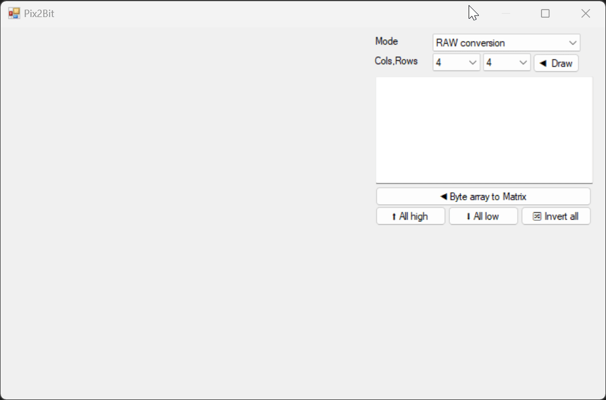

# Pix2Bit

**DISCLAIMER**
I do not plan to actively maintain this unless I require something in particular, you are free and encouraged to extend it, rewrite it, etc.

**Pix2Bit** is a versatile and easy-to-use application designed for converting pixel-based patterns into byte array sequences, specifically tailored for display on LED matrices. This tool is ideal for hobbyists, makers, and developers working with LED displays, allowing them to design custom graphics and translate them directly into bytecode suitable for embedded systems.

### Screenshot

## Features

### 1. **Grid-Based Design Interface**
   - The app provides a 16x16 pixel grid where each pixel can be toggled on or off. Users can directly interact with this grid to create custom designs.
   - Each cell in the grid represents a bit in the byte array output. Toggling a cell changes its state from low (gray) to high (red), corresponding to a binary value of `0` or `1`.

### 2. **Dynamic Grid Control**
   - Users can configure the grid size using combo boxes to select different horizontal and vertical bit resolutions (multiples of 4, ranging from 4x4 to 64x64).
   - This flexibility allows for a wide variety of pattern sizes beyond the default 16x16 grid.

### 3. **Byte Array Output**
   - The app automatically converts the current state of the grid into a hexadecimal byte array, displayed in a text box. This byte array can be directly used in embedded programming for LED matrices.
   - Supports two conversion methods:
     - **RAW Conversion**: Converts the grid as is into a byte array, row by row.
     - **KS0262 Conversion**: A special format for specific LED drivers, which uses a different byte arrangement.

### 4. **Load and Apply Byte Arrays**
   - Users can paste existing byte arrays into the text box. The app will interpret and apply these arrays to the grid, enabling easy visualization and modification of pre-existing patterns.
   - When a valid byte array is pasted, the grid updates to reflect the pattern represented by the array.

### 5. **Control Options for Rows and Columns**
   - Context menus available on row and column labels offer quick actions:
     - **Low all**: Sets all cells in the selected row/column to low (gray).
     - **High all**: Sets all cells in the selected row/column to high (red).
     - **Invert all**: Toggles the state of all cells in the selected row/column.
   - Labels can be clicked (left or right) to show the context menu, providing easy access to these features.

### 6. **Global Control Buttons**
   - Three main buttons allow for global control of the grid:
     - **High All**: Sets all cells in the grid to high (red).
     - **Low All**: Sets all cells in the grid to low (gray).
     - **Invert All**: Inverts the state of every cell in the grid.

### 7. **Tooltips**
   - Each cell in the grid has a tooltip displaying its coordinates in the format `Row X, Col Y`, aiding in precise design and debugging.

### 8. **Context Menu for Labels**
   - Right-clicking on row or column labels opens a context menu with options to modify the entire row or column, improving ease of use for large grids.

### 9. **Resizable Grid Cells**
   - The grid is responsive and adjusts cell sizes to ensure uniformity. The layout adapts when the window is resized, maintaining square proportions for each cell.

## How to Use

1. **Setting Up the Grid**:
   - Open the app and choose the desired grid size using the combo boxes for horizontal and vertical bits. Click on "Generate Table" to create the grid.
   
2. **Designing a Pattern**:
   - Click on individual cells to toggle their state. Red indicates high (1), and gray indicates low (0). Use the context menu on labels for bulk actions on rows and columns.

3. **Converting to Byte Array**:
   - The byte array is automatically updated as you modify the grid. The array is shown in the text box at the bottom, formatted for easy copy-pasting into code.

4. **Loading a Byte Array**:
   - Paste a byte array into the text box and click "Byte Array to Matrix". The grid will update to show the pattern represented by the array.

5. **Saving Patterns**:
   - Copy the generated byte array from the text box for use in your embedded projects.

6. **Global Controls**:
   - Use the "High All", "Low All", and "Invert All" buttons to quickly modify the entire grid.

## Example Use Case

- **Creating Custom LED Patterns**: Use the grid to design patterns like letters, numbers, or icons, convert them to byte arrays, and integrate them into microcontroller-based LED projects.
- **Debugging Existing Patterns**: Load an existing byte array to visualize the pattern and make modifications directly on the grid.
- **Education and Learning**: Ideal for learning about binary representation, LED matrix controls, and microcontroller programming.

## Installation

To use Pix2Bit, simply download the source code or binary release from the [GitHub repository](#). Follow the instructions to build and run the app on your local machine.

### Prerequisites
- .NET Framework (for running the Windows Forms application).

## License

This project is licensed under the [MIT License](LICENSE). You are free to use, modify, and distribute this software. However, please retain reference to the original author.

